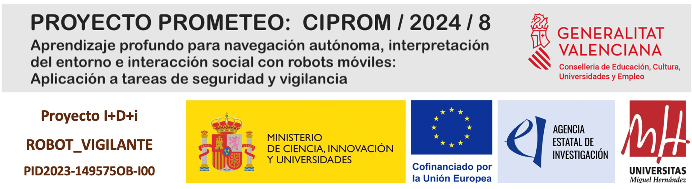

# Localización visual mediante imágenes omnidireccionales y técnicas de fusión temprana

**Abstract**
Las cámaras omnidireccionales son una opción recomendable para la localización de robots móviles, debido a su capacidad de extraer información abundante y contextual de la escena con un elevado campo de visión. No obstante, la información visual es inherentemente sensible a los cambios de apariencia del entorno, lo que puede afectar a la robustez del sistema. Para abordar esta limitación, en este trabajo se propone combinar imágenes omnidireccionales con características intrínsecas derivadas de ellas, como la intensidad promedio o la magnitud del gradiente, mediante técnicas de fusión temprana. Posteriormente, la información fusionada es procesada por una red neuronal convolucional, previamente entrenada con extensas bases de datos para la tarea de localización visual. Los resultados obtenidos demuestran que enriquecer la información visual con estas características mejora significativamente la robustez del sistema, permitiendo una localización precisa y fiable tanto en entornos interiores como exteriores, incluso bajo condiciones de iluminación muy variadas.

NOTA: El código utilizado se añadirá próximamente.

**Agradecimientos**
Este trabajo se enmarca dentro del proyecto TED2021-130901B-I00, financiado por MICIU/AEI/10.13039/501100011033 y por la Unión Europea NextGenerationEU/PRTR. También forma parte del proyecto PID2023-149575OB-I00, financiado por MICIU/AEI/10.13039/501100011033 y por FEDER, UE.

    

